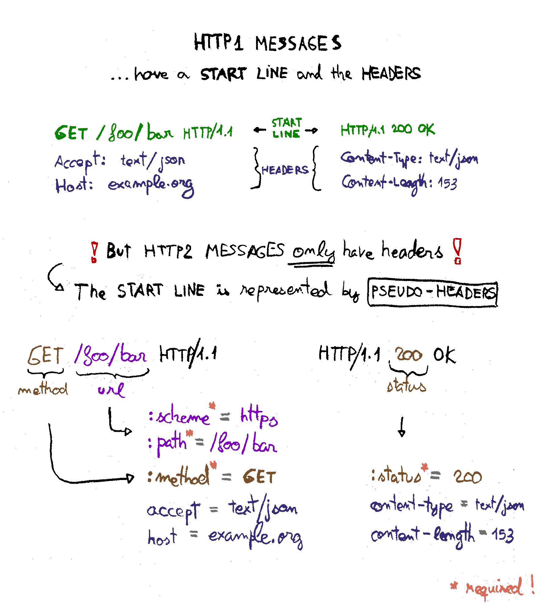
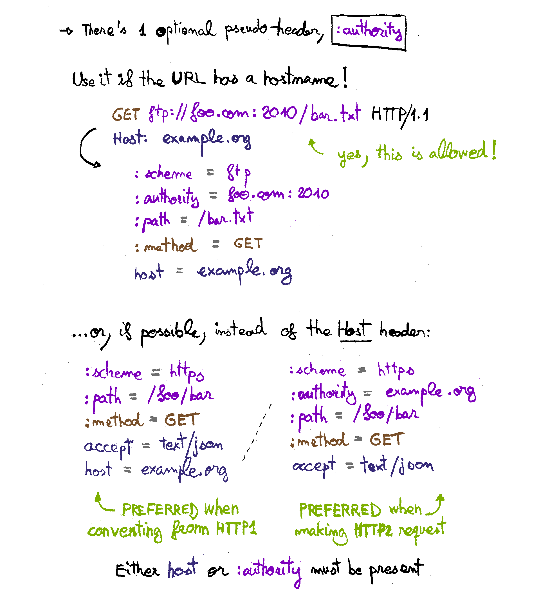
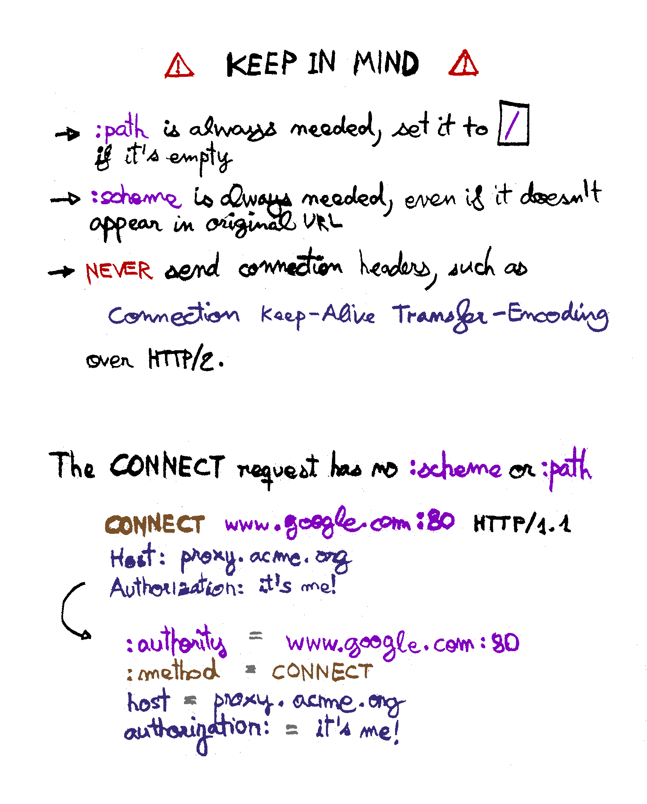

# Guide: HTTP/2 pseudo-headers

Explains the need for HTTP/2 pseudo-headers, which ones there are,
and when are they used.

### References

HTTP/2 spec, section about headers:  
<https://tools.ietf.org/html/rfc7540#section-8.1.2>

HTTP/1.1 spec, section about request target types:  
<https://tools.ietf.org/html/rfc7230#section-5.3>
